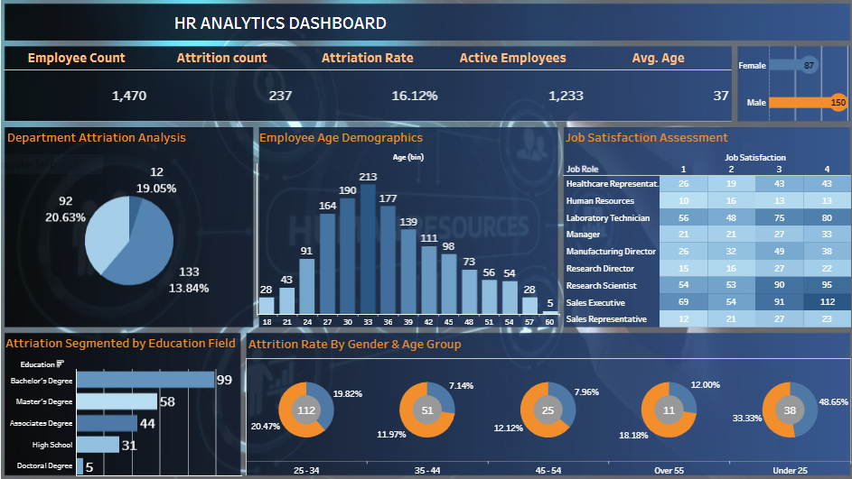

# 👩‍💼 HR Analytics Dashboard (Tableau)

An interactive **Tableau Dashboard** analyzing employee data, performance, and organizational insights.  
The dashboard visualizes key HR metrics such as attrition rate, satisfaction, gender ratio, and departmental performance — empowering HR teams to make data-driven decisions.

---

## 📊 Project Overview

This Tableau project explores the key factors influencing employee engagement and attrition within an organization.  
It helps visualize how age, department, experience level, and job satisfaction impact employee retention and productivity.

The dashboard provides filters for gender, department, and role to allow detailed analysis and comparison.

---

## 🎯 Objectives

- Analyze employee demographics and distribution across departments  
- Understand attrition trends and satisfaction levels  
- Identify key factors affecting employee retention  
- Support HR strategy with data visualization and insights  

---

## 🖼️ Dashboard Preview

| Overview |
|-----------|
|  |

---

## 🔗 Live Dashboard

You can explore the live interactive version here:  
👉 [View on Tableau Public](https://public.tableau.com/app/profile/rania.elwan/viz/Book1_17606513899560/Dashboard1)

---

## 🛠️ Tools Used

- **Tableau Public** – Data visualization & dashboard creation  
- **Excel / CSV** – Data source for employee records  
- **Data Cleaning & Preparation** – Conducted within Tableau  

---

## 📁 Dataset

The dataset used for this project is included in this repository under the name **`HR_Data.csv`**.  
It contains detailed employee information including:

- Employee demographics (age, gender, marital status)  
- Job-related data (department, role, years of experience)  
- Performance metrics (job satisfaction, salary, attrition)  

This dataset was used for data cleaning, exploration, and visualization within Tableau.

---

## 💡 Key Insights

- Higher attrition rates were found among employees with lower satisfaction scores.  
- The Sales and R&D departments showed the highest turnover.  
- Mid-career employees reported higher satisfaction than new hires.  
- Gender balance varied across departments but had minimal effect on attrition.  

---

## 👩‍💻 Author

**Rania Sami Mohamed Elwan**  
_Data Analyst | Tableau | Power BI | SQL | Excel_

